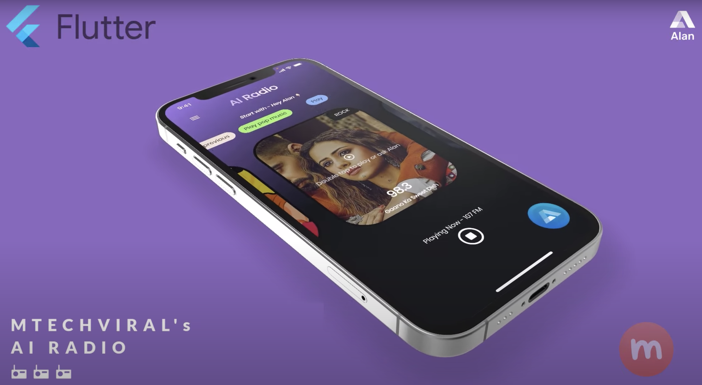
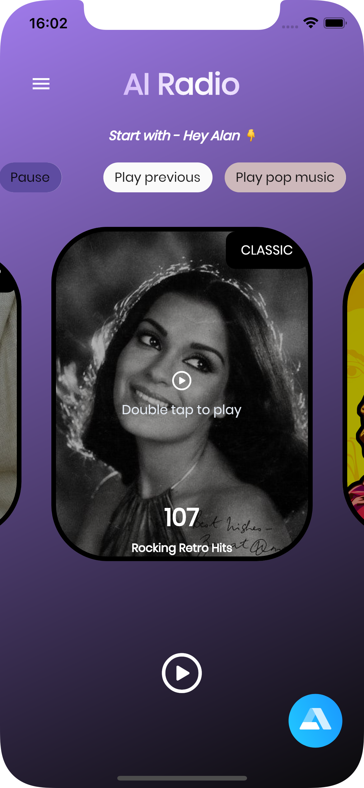
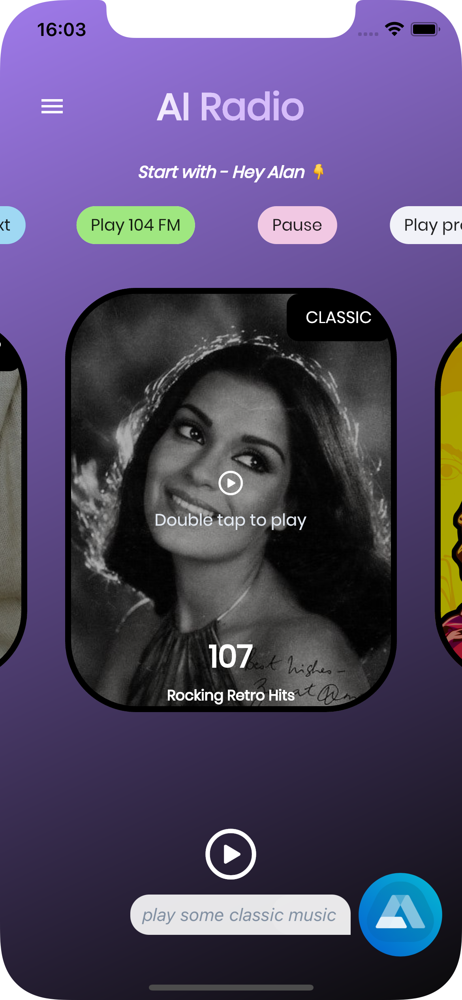
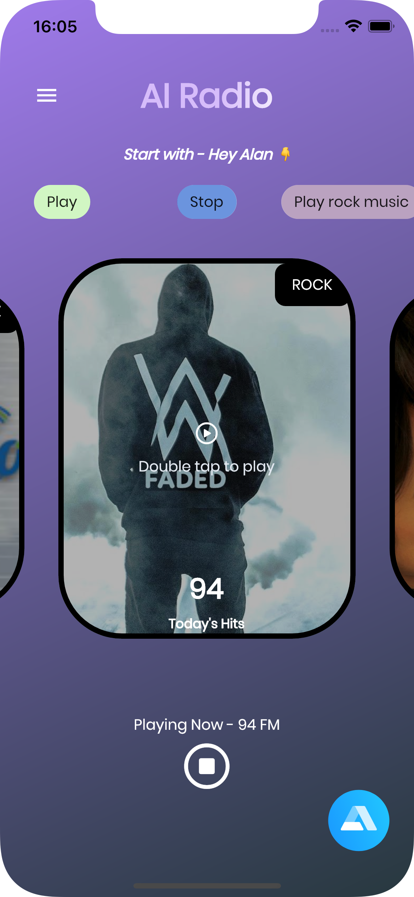
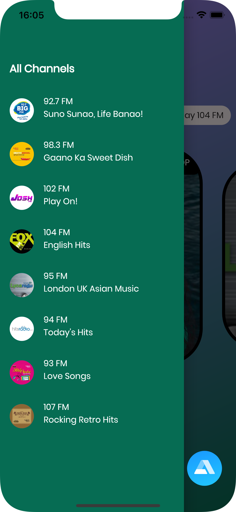

# AI-Powered Voice Assistant Flutter Radio App

This is a radio app where you can ask Alan AI to play some music.

  

> Alan AI: https://voice.alan.app/MTechViral
>
> Promo Code: MTECHVIRAL

### Show some :heart: and star the repo.

## AI Radio Video Tutorial

[Watch here](https://youtu.be/p4xh7zTt6i0)

---

## 

## Some screenshots

|                                      |                                      |
| ------------------------------------ | ------------------------------------ |
|  |  |
|   |   |
|   |

---

### :heart: Found this project useful?

If you found this project useful, then please consider giving it a :star: on Github and sharing it with your friends via social media.

---

### YouTube Channel

[MTechViral](https://www.youtube.com/mtechviral)

### Facebook Group

[Let's Flutter With Dart](https://www.facebook.com/groups/425920117856409/)

### Collection of flutter apps with tutorial

[Flutter Example Apps](https://github.com/iampawan/FlutterExampleApps)

---

## Project Created & Maintained By

### Pawan Kumar

Google Developer Expert for Flutter. Passionate #Flutter, #Android Developer. #Entrepreneur #YouTuber

 

# Donate

> If you found this project helpful or you learned something from the source code and want to thank me, consider buying me a cup of :coffee:
>
> - [PayPal](https://www.paypal.me/imthepk/)

## Getting Started

This project is a starting point for a Flutter application.

A few resources to get you started if this is your first Flutter project:

- [Lab: Write your first Flutter app](https://flutter.dev/docs/get-started/codelab)
- [Cookbook: Useful Flutter samples](https://flutter.dev/docs/cookbook)

For help getting started with Flutter, view our
[online documentation](https://flutter.dev/docs), which offers tutorials,
samples, guidance on mobile development, and a full API reference.
